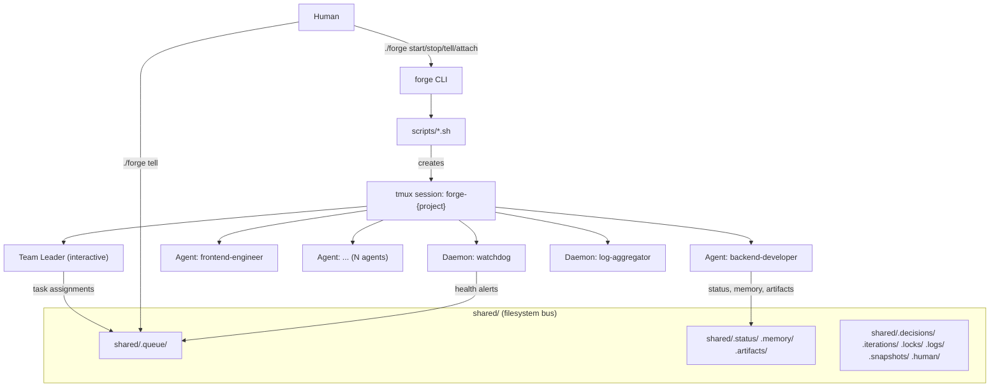

# Forge Architecture

How the Forge framework works internally -- agent orchestration, communication, lifecycle, and design decisions.

---

## Overview

Forge is an agent orchestration framework built on three primitives: **Claude Code** (the AI engine), **tmux** (process isolation), and the **shared filesystem** (communication bus). A single CLI entry point (`./forge`) delegates to bash scripts in `scripts/`, which manage agent lifecycle, monitoring, and state persistence.

The core flow: the user edits `config/team-config.yaml` and runs `./forge start`. The start script creates a tmux session, initializes `shared/`, and spawns the Team Leader. The Team Leader reads config, requests a strategy from the Research Strategist, decomposes the project into tasks, spawns worker agents, and drives iterations through a 7-phase lifecycle until the project is complete. The user can interact at any time via `./forge tell`, `./forge attach`, or `./forge stop`.

## Forge Dir vs Project Dir

Forge separates two directories:

- **Forge Dir** (`FORGE_DIR`) — Where the forge framework is installed (this repo). Contains `agents/`, `scripts/`, `templates/`, `config/`, `shared/`, and the `forge` CLI.
- **Project Dir** (`PROJECT_DIR`) — Where agents build the user's project. This is a separate workspace directory, never inside the forge repo.

The project directory is resolved via a priority chain:
1. `--project-dir` CLI flag (highest priority, for one-off runs or CI)
2. `project.directory` in `config/team-config.yaml` (persisted after first prompt)
3. `project.existing_project_path` (for brownfield projects)
4. Interactive prompt at first `./forge start` (defaults to `~/forge-projects/<name>`)

In auto-pilot mode, the default directory is used without prompting. A safety check warns if the project directory equals the forge directory.

## Architecture Diagram

## Tmux and Agents

Every Forge session creates one tmux session named `forge-{project-name}`. Each agent runs as its own tmux window: `team-leader` (interactive -- the human can attach via `./forge attach`), `watchdog`, `log-aggregator`, and one window per worker agent. The Team Leader spawns agent windows dynamically using `scripts/spawn-agent.sh` and removes them with `scripts/kill-agent.sh`. Multiple instances of the same type (e.g., `backend-developer-1`, `backend-developer-2`) get unique window names.

## Strategy-Based Permissions

The configured execution strategy maps to Claude Code permission flags when spawning agents:

| Strategy | Permission Flag | Effect |
|----------|----------------|--------|
| `auto-pilot` | `--dangerously-skip-permissions` | Fully autonomous, no approval prompts |
| `co-pilot` | `--permission-mode acceptEdits` | Auto-approve file edits, prompt for commands |
| `micro-manage` | _(default)_ | Interactive approval for all operations |

In auto-pilot mode, the Team Leader also runs in `--print` mode (headless) to avoid the interactive bypass-permissions confirmation prompt, enabling fully unattended operation.

## The shared/ Directory

The `shared/` directory is the entire communication substrate. Created at runtime, never committed to git:

| Path | Purpose |
|------|---------|
| `.queue/{agent}-inbox/` | Message queue -- one file per message, processed in timestamp order |
| `.status/{agent}.json` | Agent status (idle, working, blocked, done, error, etc.) |
| `.memory/{agent}-memory.md` | Working memory -- full context for resume after restart |
| `.decisions/decision-log.md` | Append-only shared decision log |
| `.iterations/` | Iteration summaries, critique reports, acceptance criteria |
| `.artifacts/registry.json` | Artifact registry tracking producers, consumers, versions |
| `.locks/{hash}.lock` | File-level locks preventing concurrent edits |
| `.logs/{agent}.log` | Structured JSONL logs per agent |
| `.snapshots/` | Fleet state snapshots for stop/resume |
| `.human/override.md` | Human override channel (written by `./forge tell`) |

All writes use the **atomic write protocol**: write to a temp file in `/tmp/`, then `mv` to the destination, guaranteeing readers never see partial content.

## Iteration Lifecycle

Every development cycle follows seven phases: `PLAN -> EXECUTE -> TEST -> INTEGRATE -> REVIEW -> CRITIQUE -> DECISION`

1. **PLAN** -- Team Leader decomposes iteration goals into tasks with dependencies. Architect defines contracts.
2. **EXECUTE** -- Worker agents implement tasks in parallel on feature branches (`agent/{name}/{task-id}`). Every agent that produces runnable code must verify it actually runs before reporting done (Output Verification Mandate, `_base-agent.md` Section 14).
3. **TEST** -- QA Engineer runs unit, integration, and e2e tests. Agents fix their own failing tests. In lean teams without QA, developers run their own tests.
4. **INTEGRATE** -- Team Leader merges feature branches to main, resolves conflicts, verifies combined build.
5. **REVIEW** -- Agents cross-review work via `review-request`/`review-response` messages (BLOCKER, WARNING, NOTE).
6. **CRITIQUE** -- Critic evaluates across three categories (Functional, Technical, User-Quality), scoring every acceptance criterion PASS or FAIL.
7. **DECISION** -- Team Leader decides: **PROCEED** (tag `iteration-{N}-verified`, compact memory), **REWORK** (back to PLAN with corrections), **ROLLBACK** (restore last verified tag), or **ESCALATE** (human approval needed).

Mode thresholds (per category): MVP 70% | Production Ready 90% | No Compromise 100%.

### Smoke Test Protocol

Before marking ANY iteration as complete, the Team Leader runs a mandatory Smoke Test Protocol:

1. **Start the application** — run the appropriate start command and confirm it starts without errors.
2. **Test backend endpoints** — for every API endpoint, send a real HTTP request and verify the response.
3. **Test frontend UI** — if the project has a UI, verify it loads and basic interactions work.
4. **Test integrations** — verify connections to databases, external APIs, and other services.
5. **Document results** — write results to `shared/.iterations/`.
6. **Fix before proceeding** — any smoke test failure is a blocker; the iteration cannot advance.

In MVP lean teams (no QA Engineer), the Team Leader is personally responsible for smoke testing. Passing unit tests is necessary but not sufficient.

## Working Memory System

Every agent maintains `shared/.memory/{agent-name}-memory.md` containing: current assignment, completed work, key decisions, dependencies, important context, next steps, and resume instructions. **The 10-minute rule**: agents must update memory at least every 10 minutes during active work. This is non-negotiable -- Claude Code sessions can be killed at any time (usage limits, crashes). The memory file is the safety net.

On restart, an agent reads its memory, status, and inbox, then resumes from "Next Steps". Memory compaction occurs after each verified iteration: old completed tasks are compressed to summaries while current assignments and constraining decisions are preserved.

## Background Daemons

**Watchdog** (`scripts/watchdog.sh`) -- Polls every 60s. Detects dead agents (tmux window gone), stale agents (status not updated >5min), rate-limited agents (429 errors, limit warnings), error spikes (>5 ERRORs in recent logs). Sends alerts to Team Leader inbox. Triggers auto-stop after configured hours. If N+ agents are rate-limited, recommends full fleet stop.

**Log Aggregator** (`scripts/log-aggregator.sh`) -- Polls every 5s. Tails all agent logs in `shared/.logs/`, appends to `combined.log`, rotates files exceeding 10MB into `archive/` with gzip compression.

**Cost Tracker** (`scripts/cost-tracker.sh`) -- Reads `cost_estimate_usd` from status files and cost entries from logs. Writes `cost-summary.json`. Alerts at 80% of configured cap.

## Stop/Resume and Snapshots

**Stop** (`./forge stop`): Broadcasts `PREPARE_SHUTDOWN` (agents get a grace period to finalize memory, commit, release locks). Captures a snapshot at `shared/.snapshots/snapshot-{timestamp}.json` with agent states, git state, costs, and iteration progress. Broadcasts `SHUTDOWN`, kills tmux windows, enforces snapshot retention.

**Resume** (`./forge start` with existing snapshot): Prompts user (Resume/No/Fresh). Loads snapshot, recreates tmux session and daemons. Spawns Team Leader with `--resume`, which reads its working memory, restores the agent fleet, sends `SESSION_RESUMED`, and greets the human with a status summary.

## CLAUDE.md Hierarchy

Forge respects the CLAUDE.md convention from Claude Code. The `claude_md` config section controls sourcing:

1. **Global** (`~/.claude/CLAUDE.md`) -- User's personal coding preferences.
2. **Project** (`{project_root}/CLAUDE.md`) -- Project-specific conventions.
3. **Agent** (generated by `init-project.sh`) -- Role-specific instructions merged with CLAUDE.md content.

Merge priority is configurable (`project-first` or `global-first`). When `source: "both"`, `init-project.sh` merges both into each generated agent instruction file at `{project}/.forge/agents/`. Project-level rules override agent defaults when they conflict.

## Design Decisions and Tradeoffs

**Why file-based messaging** -- Atomic `mv` is the only primitive needed for safe concurrent writes. No database drivers, no network protocols, no dependencies beyond a POSIX filesystem. Messages are human-readable markdown files -- anyone can `ls` the queue or `cat` a message. Tradeoff: no guaranteed cross-inbox ordering, but the Team Leader serializes all coordination decisions, making this acceptable.

**Why tmux** -- Process isolation (a crash in one agent does not affect others), human observability (`tmux attach` to watch any agent live), interactive Team Leader (human types commands directly), and simple lifecycle (`new-window` to spawn, `kill-window` to stop). Tradeoff: requires tmux installed, but it is available on every major platform.

**Why markdown for agent instructions** -- Agent MD files are loaded directly as system prompts for Claude Code. Markdown is the native format LLMs understand best. Each file is self-contained: an agent reading only its own file plus `_base-agent.md` has everything needed. Tradeoff: less structured than YAML/JSON for machine parsing, but the consumer is an LLM, not a parser.
